# bash 跟着敲

前言：本文不单单是介绍常用的命令，还融入了bash语法，每个知识点都有浅显的例子配合，让你很容易消化并吸收，最后还有一个boss任务等你挑战，耐心学完的同学肯定会有很大的收获的。大家觉得有用的话，star一下，然后可以随意分享给需要的人，重点是加颗星星哦，加颗星星哦，加颗星星哦。 【持续更新】

<!-- TOC -->

- [bash 跟着敲](#bash-跟着敲)
    - [一. 硬件、内核、shell](#一-硬件内核shell)
    - [二. 命令行](#二-命令行)
        - [1. 基本操作](#1-基本操作)
            - [export](#export)
            - [whatis](#whatis)
            - [whereis](#whereis)
            - [which](#which)
            - [clear](#clear)
        - [2. 文件操作](#2-文件操作)
            - [cat](#cat)
            - [chmod](#chmod)
            - [cp](#cp)
            - [diff](#diff)
            - [find](#find)
            - [head](#head)
            - [ls](#ls)
            - [mv](#mv)
            - [rm](#rm)
            - [touch](#touch)
        - [3. 文本操作](#3-文本操作)
            - [awk](#awk)
            - [grep](#grep)
            - [sed](#sed)
            - [sort](#sort)
            - [wc](#wc)
        - [4. 目录操作](#4-目录操作)
            - [cd](#cd)
            - [mkdir](#mkdir)
            - [pwd](#pwd)
        - [5. SSH,系统信息，网络操作](#5-ssh系统信息网络操作)
            - [cal](#cal)
            - [date](#date)
            - [df](#df)
            - [du](#du)
            - [ps](#ps)
            - [ssh](#ssh)
            - [top](#top)
    - [三. 语法](#三-语法)
        - [1 条件判断](#1-条件判断)
            - [1.1 test判断语句](#11-test判断语句)
            - [1.2 []条件判断](#12-条件判断)
        - [2 if then else语句](#2-if-then-else语句)
        - [3 case语句](#3-case语句)
        - [4 for循环](#4-for循环)
        - [5 while循环](#5-while循环)
        - [6 使用break和continue控制循环](#6-使用break和continue控制循环)
    - [四. 数组](#四-数组)
        - [1 数组定义](#1-数组定义)
        - [2 数组操作](#2-数组操作)
    - [五.函数](#五函数)
    - [六.数值运算](#六数值运算)
    - [七. 字符运算](#七-字符运算)
    - [八. bash调试](#八-bash调试)
        - [bash [-nvx] scripts.sh](#bash--nvx-scriptssh)
        - [echo [-neE] string](#echo--nee-string)
    - [九. bash内建指令](#九-bash内建指令)
        - [echo](#echo)
        - [read](#read)
        - [alias](#alias)
        - [export](#export-1)
        - [exec](#exec)
        - [.](#)
        - [exit](#exit)
    - [十. 参考资料](#十-参考资料)
    - [十一. 大BOSS](#十一-大boss)
    - [十二. 命令详解](#十二-命令详解)

<!-- /TOC -->

## 一. 硬件、内核、shell

下面这张摘自鸟哥的图可以很好的说明
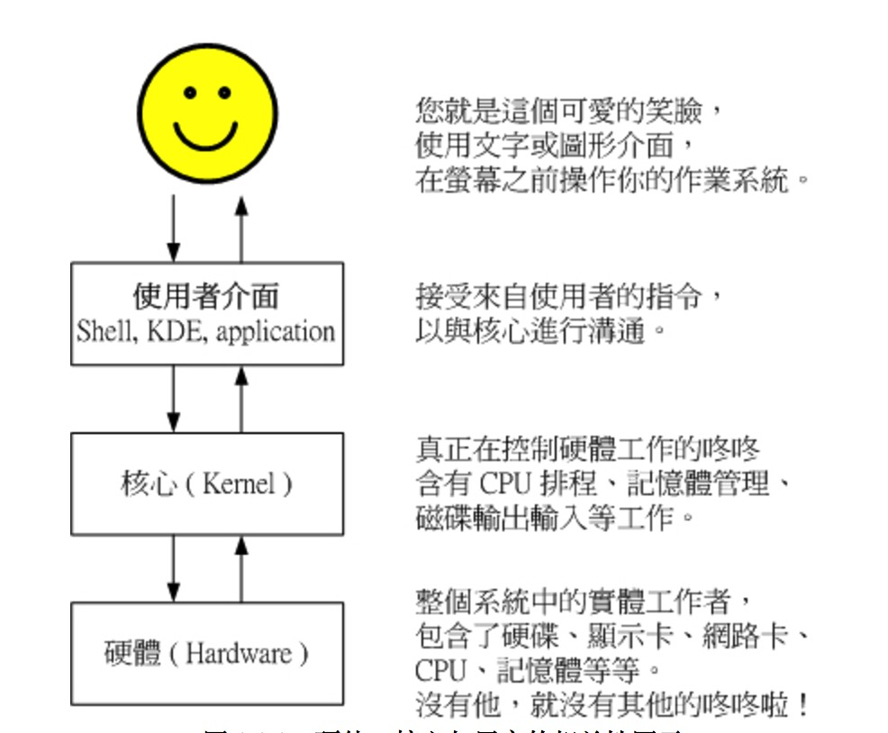

## 二. 命令行

### 1. 基本操作

#### export

展示全部的环境变量，如果你想获取某个特殊的变量，用 `echo $变量名`
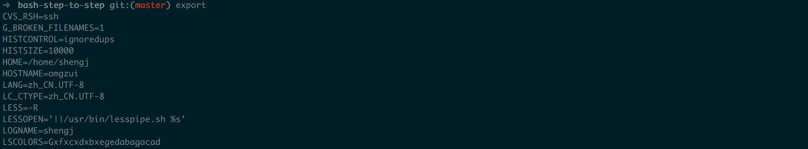


#### whatis

展示用户命令，系统调用、库函数等
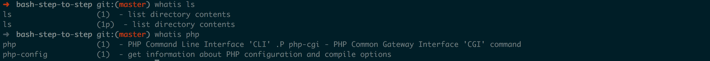

#### whereis

搜索可执行文件、源文件
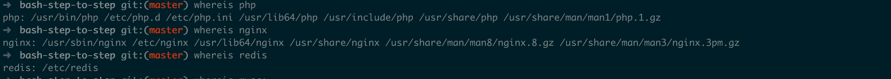

#### which

在环境变量中搜索可执行文件，并打印完整路径
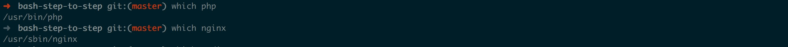

#### clear

清空屏幕
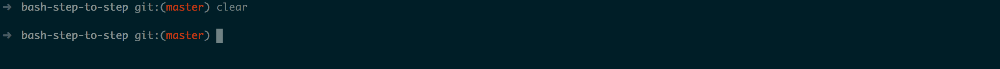

### 2. 文件操作

#### cat

在屏幕上显示文本文件
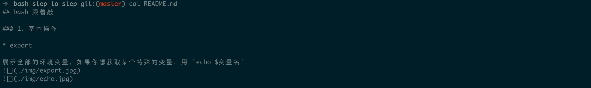

#### chmod

可以改变文件和目录的读、写、执行权限
[linux 中的用户、组、文件][1]

#### cp

复制文件
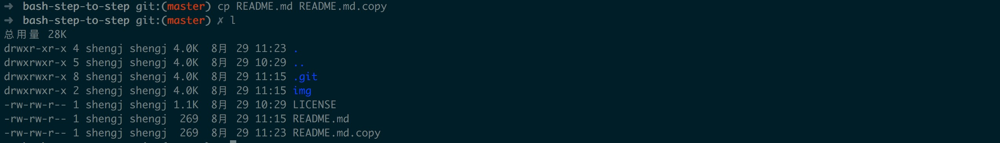

#### diff

比较文件，我在上面复制的文件中加了一行diff


#### find

查找文件，可以通过正则来查
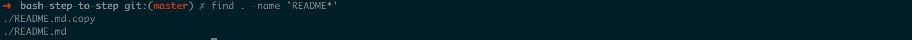

#### head

查看文件前10行
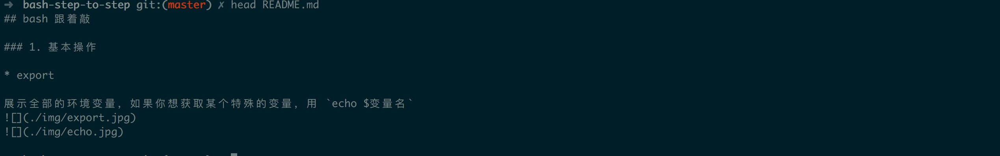

#### ls

显示所有文件，`-l`显示长格式化 `-a`显示包括隐藏文件
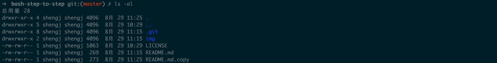

#### mv

移动文件，同时也可以重命名文件
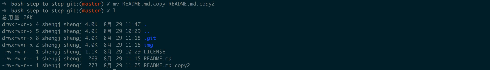

#### rm

删除文件，`-r`删除目录 `-f`强制删除


#### touch

创建新文件
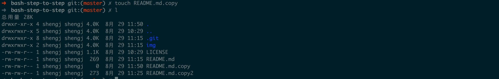

### 3. 文本操作

#### awk

非常有用的一个文本处理命令，逐行运行，默认使用空格分割，`-F`表示分割的样式
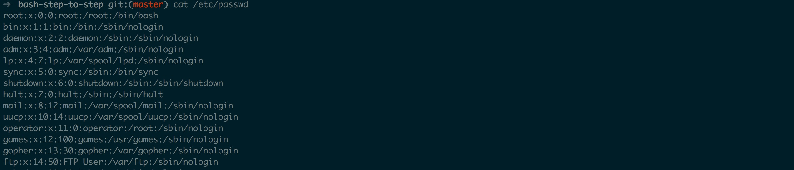
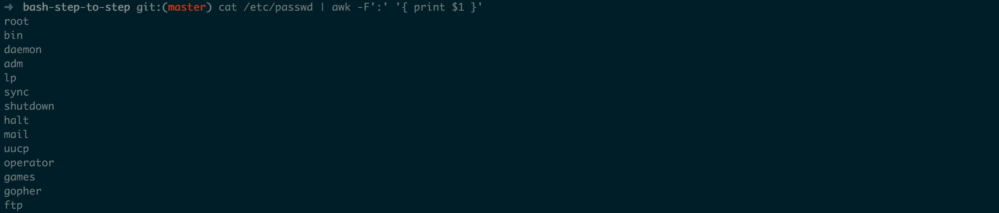

#### grep

匹配正则表达式的文本行，并输出，`-E`正则模糊匹配 `-F`精确字母匹配 `-w`精确单词匹配
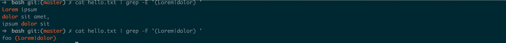
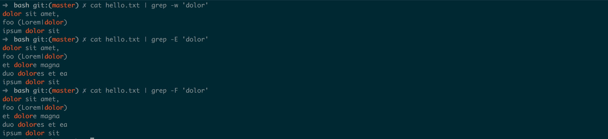

#### sed

正则替换
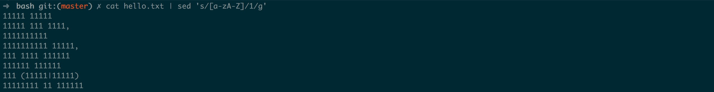

#### sort

排序
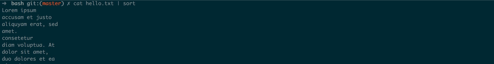

#### wc

统计文本行数，单词数，字符数
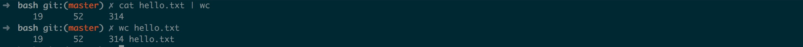

### 4. 目录操作

#### cd

进入目录

#### mkdir

创建目录

#### pwd

当前目录的路径
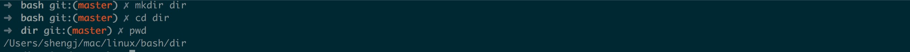

### 5. SSH,系统信息，网络操作

#### cal

月历
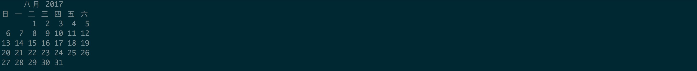

#### date

当前日期和时间


#### df

磁盘使用情况

#### du

文件或目录使用情况
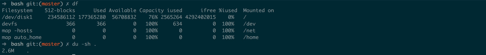

#### ps

列出你的进程
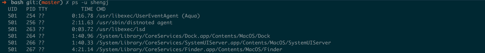

#### ssh

远程连接


#### top

列出当前活动进程
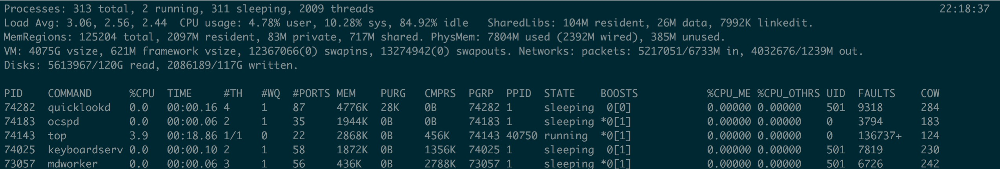

## 三. 语法

### 1 条件判断

#### 1.1 test判断语句

test是关键字，表示判断；EXPRESSION是被判断的语句。

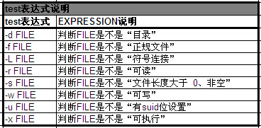

`echo $?` 输出判断结果，0表示成功，其他表示失败。
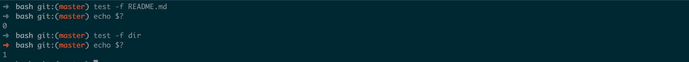

#### 1.2 []条件判断

中括号的左右扩弧和EXPRESSION之间都必须有空格！
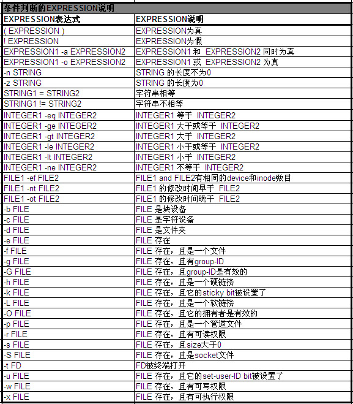

文件类型判断
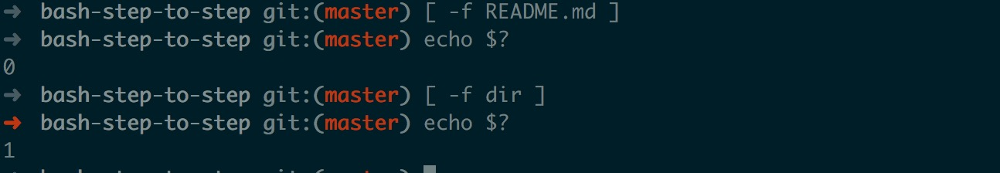
字符串和数字判断
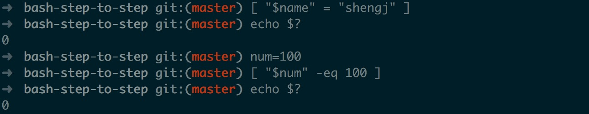

### 2 if then else语句

例子1：判断文件README.md是不是文件

```sh
#!/bin/bash

if [ -f ../README.md ];then
echo 'file exist'
else
echo 'file not exist'
fi

exit 0
```

例子2：提示用户输入值，如果大于0输出’正数’，小于0输出’负数‘，等于0输出’零‘

```sh
#!/bin/bash

# 提示用户输入一个值
echo -n "请输入一个数字："

# 保存用户输入的值到num中
read num

if [ "$num" -gt 0 ];then
echo '正数'
elif [ "$num" -lt 0 ];then
echo '负数'
else
echo '零'
fi

exit 0
```

### 3 case语句

例子：提示用户输入Y/y或N/n。若输入Y/y，则输出“我们约起来吧”；若输入N/n,则输出“不约，再见”；否则，“输入有误”

```sh
#!/bin/bash

echo -n "你单身吗？(y/n)"

read val

case $val in
Y|y)
echo "我们约起来吧"
;;
N|n)
echo "不约，再见"
;;
*)
echo "输入有误"
;;
esac

exit 0
```

### 4 for循环

例子1：输出当前文件夹的一级子目录中文件名字

```sh
#!/bin/bash

# 将ls的结果保存到变量CUR_DIR中
CUR_DIR=`ls`

# 显示ls的结果
echo $CUR_DIR

for val in $CUR_DIR
do
if [ -f $val ];then
echo "FILE: $val"
fi
done

exit 0
```

例子2：输出1-10之间数字的总和

```sh
#!/bin/bash

sum=0
for ((i=1;i<10;i++))
do
((sum=$sum+$i))
done

echo "sum=$sum"

exit 0
```

### 5 while循环

例子：从0开始逐步递增，当数值等于5时，停止递增

```sh
#!/bin/bash

val=0

while [ "$val" -lt 5 ]
do
echo "val=$val"
((val++))
done

exit 0
```

### 6 使用break和continue控制循环

break命令允许跳出循环

continue命令类似于 break命令,只有一点重要差别,它不会跳出循环,只是跳过这个循环步。

例子1：[break应用]从0开始逐步递增，当数值等于5时，停止递增。

```sh
#!/bin/bash

# 设置起始值为0
val=0

while true
do
if [ "$val" -eq "5" ];then
# 如果val=5，则跳出循环
break;
else
# 输出数值
echo "val=$val"
# 将数值加1
((val++))
fi
done

exit 0
```

例子2：[continue应用]从0开始逐步递增到10：当数值为5时，将数值递增2；否则，输出数值

```sh
#!/bin/bash

# 设置起始值为0
val=0

while [ "$val" -le "10" ]
do
if [ "$val" -eq "5" ];then
# 如果val=5，则将数值加2
((val=$val+2))
continue;
else
# 输出数值
echo "val=$val"
# 将数值加1
((val++))
fi
done

exit 0
```

## 四. 数组

### 1 数组定义

- array=(10 20 30 40 50)

一对括号表示是数组，数组元素用“空格”符号分割开。引用数组时从序号0开始。

- 除了上面的定义方式外，也可以单独定义数组：

```sh
array[0]=10
array[1]=20
array[2]=30
array[3]=40
array[4]=50
```

- var="10 20 30 40 50"; array=($var)

### 2 数组操作

[数组操作][2]

```sh
#!/bin/bash

array=(10 20 30 40 50)

# 显示数组中所有元素
echo '显示数组中所有元素'
echo ${array[*]}
echo ${array[@]}

# 显示数组第2项
echo '显示数组第2项'
echo ${array[1]}

# 显示数组长度
echo '显示数组长度'
echo ${#array[@]}

# 输出数组的第1-3项
echo '输出数组的第1-3项'
echo ${array[@]:0:3}

# 将数组中的0替换成1
echo '将数组中的0替换成1'
echo ${array[@]/0/1}

# 删除数组第2项元素  
# 说明：
# unset仅仅只清除array[1]的值，并没有将array[1]删除掉
echo '删除数组第2项元素'
unset array[1]
echo ${array[@]}

exit 0
```

## 五.函数

[函数实例][3]

```sh
#!/bin/bash

# 编辑一个函数foo：打印foo的输入参数的总数，并输入每个参数和参数对应的序号。
function foo()
{
    # 定义局部变量i
    local i=0 
    # 定义局部变量total=传入foo的参数总数
    local total=$#
    # 输出参数总数
    echo "total param =$total"
    # 输出传入foo的每一个参数
    for val in $@
    do
        ((i++))
        echo "$i -- val=$val"
    done

    # 返回参数总数
    return $total
}

foo
foo param1 param2 param3
# 输出foo param1 param2 param3的返回值
echo "return value=$?"

exit 0
```

## 六.数值运算

```sh
数值元算主要有4种实现方式：(())、let、expr、bc。
工作效率：(()) == let > expr > bc**
(())和let是bash内建命令，执行效率高；而expr和bc是系统命令，会消耗内存，执行效率低。
(())、let和expr只支持整数运算，不支持浮点运算；而bc支持浮点运算。
```

[数值运算][4]
实例1：用4中方式实现`3*(5+2)`

```sh
#!/bin/bash

# (())
val1=$((3*(5+2)))
echo "val1=$val1"

# let
let "val2=3*(5+2)"
echo "val2=$val2"

# expr
val3=`expr 3 \* \(5+2\)`
echo "val3=$val3"

# bc
val4=`echo "3*(5+2)"|bc`
echo "val4=$val4"

exit 0
```

实例3：5/3浮点运算，保留3位小数

```sh
#!/bin/bash

# bc 实现5/3浮点运算，保留3位小数
val5=`echo "scale=3; 5/3"|bc`
echo "val5=$val5"

exit 0
```

## 七. 字符运算

[字符运算][5]

```sh
#!/bin/bash

str='hello world'

# 显示字符串
echo '显示字符串'
echo ${str}

# 显示字符串长度
echo '显示字符串长度'
echo ${#str}

# 提取world
echo '提取world'
echo ${str:6}

# 提取or
echo '提取or'
echo ${str:7:2}

# 删除hello
echo '删除hello'
echo ${str#hello}

# 删除world
echo '删除world'
echo ${str%world}

# 将所有的字符l替换为m
echo '将所有的字符l替换为m'
echo ${str//l/m}

exit 0
```

## 八. bash调试

### bash [-nvx] scripts.sh

```sh
选项与参数:
-n: 不要执行 script,仅查询语法的问题;
-v: 再执行 sccript 前,先将 scripts 的内容输出到屏幕上;
-x: 将使用到的 script 内容显示到屏幕上,这是很有用的参数!
```

例子：想要执行bash脚本，并查看bash的调用流程，可以通过以下命令：

`bash -x test.sh`

### echo [-neE] string

```sh
选项与参数:
-n: 输出内容之后，不换行。默认是输入内容之后，换行。
-e: 开启反斜线“\”转义功能
-E: 开启反斜线“\”转义功能（默认）。
```

例子：输出please input a number:之后不换行

`echo -n "please input a number:"`

## 九. bash内建指令

### echo

在屏幕上显示出指定的字串

### read

从标准输入设备读入一行，分解成若干字，赋值给bash程序内部定义的变量

### alias

别名,`alias l='ls -al'`

### export

export可以把bash的变量向下带入子bash(即子bash中可以使用父bash的变量)，从而让子进程继承父进程中的环境变量。但子bash不能用export把它的变量向上带入父bash。

### exec

当bash执行到exec语句时，不会去创建新的子进程，而是转去执行指定的命令，当指定的命令执行完时，该进程（也就是最初的bash）就终止了，所以bash程序中exec后面的语句将不再被执行。

### .

使bash读入指定的bash程序文件并依次执行文件中的所有语句。

### exit

退出Shell程序，在exit之后可有选择地指定一个数位作为返回状态。

## 十. 参考资料

后语：大家觉得有用的话，star一下，然后可以随意分享给需要的人，重点是加颗星星哦，加颗星星哦，加颗星星哦。

- [Linux bash总结(一) 基础部分(适合初学者学习和非初学者参考)][6]
- [bash-guide][7]
- [ssr.sh][8]
- [Markdown-TOC][9]

## 十一. 大BOSS

[大BOSS][10]

## 十二. 命令详解

- [ ] basic
- [ ] file
- [ ] text
- [ ] directory
- [ ] sys

[1]:./linux-user-group-file.md
[2]:./dir/array.sh
[3]:./dir/function.sh
[4]:./dir/operation.sh
[5]:./dir/string.sh
[6]:http://www.cnblogs.com/skywang12345/archive/2013/05/30/3106570.html
[7]:https://github.com/Idnan/bash-guide
[8]:https://doub.bid/ss-jc42/
[9]:https://github.com/AlanWalk/Markdown-TOC
[10]:./ssr.sh
