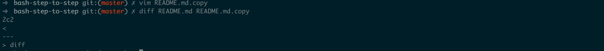

## bash 跟着敲

### 1. 基本操作

* export 

展示全部的环境变量，如果你想获取某个特殊的变量，用 `echo $变量名`

* whatis

展示用户命令，系统调用、库函数等

* whereis

搜索可执行文件、源文件

* which

在环境变量中搜索可执行文件，并打印完整路径

* clear

清空屏幕

### 2. 文件操作

* cat

在屏幕上显示文本文件

* chmod

可以改变文件和目录的读、写、执行权限
[linux 中的用户、组、文件][1]

* cp

复制文件

* diff

比较文件，我在上面复制的文件中加了一行diff

* find

查找文件，可以通过正则来查

* head

查看文件前10行

* ls

显示所有文件，`-l`显示长格式化 `-a`显示包括隐藏文件

* mv

移动文件，同时也可以重命名文件

* rm

删除文件，`-r`删除目录 `-f`强制删除

* touch

创建新文件

### 3. 文本操作

[1]:http://omgzui.pub/linux